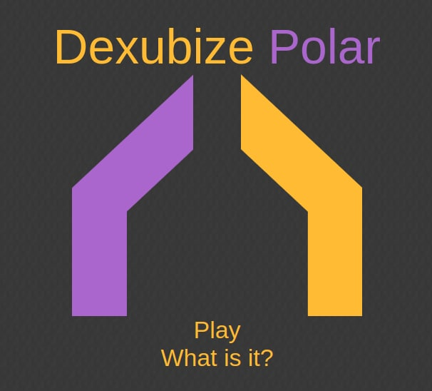
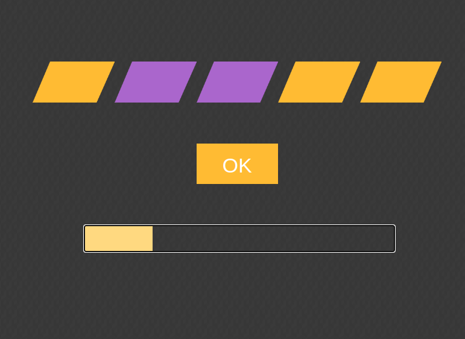
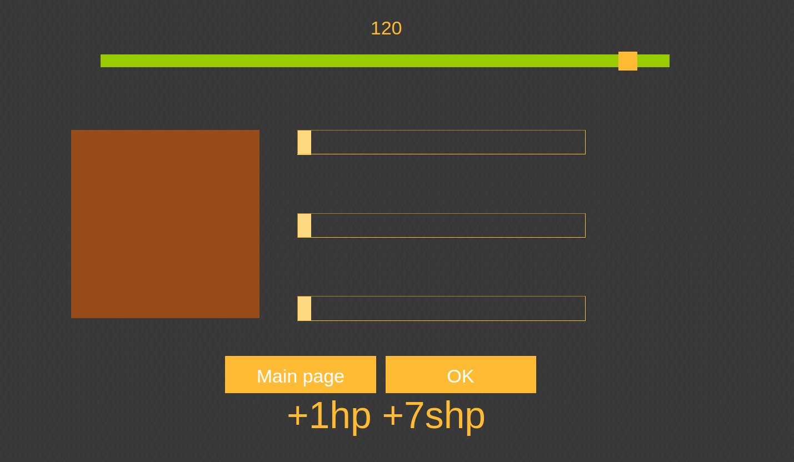
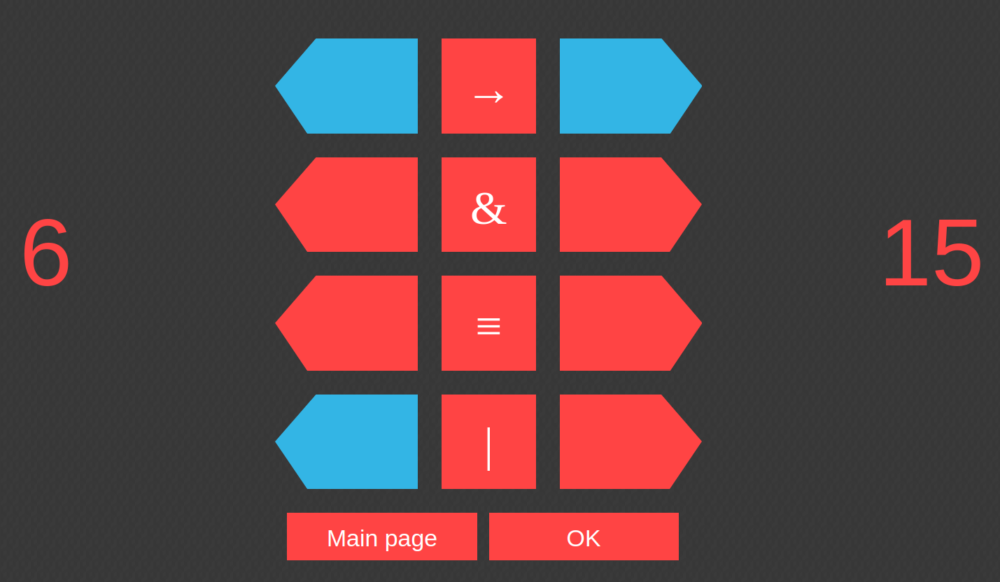

# Polar

A legacy project for checking one's knowledge of the binary numeral system and evaluating related skills. The original version of the project was created in 2014. The system gives user a number in binary format and the user is asked to type the corresponding number in the decimal numeral system. The project was largely inspired by the [elevate](https://elevateapp.com/) app. It features multiple difficulty levels as well as restricted time and allowed number of mistakes in one session. If all attempts are exhausted, then additional attempts may be earned by performing a couple of additional tasks.



## Running the app

For running the app one just needs to start any web-server with cloned repository directory as the root folder. For instance, package `http` might be used from the `python` ecosystem:

```sh
python -m http.server 8080
```

The mentioned command was checked on `Ubuntu 22.04`, and everything works fine.

## The main game

For instance on the following screenshot presents a task of translating the number `10011` from the binary into the decimal numeral system. The progress bar informs user how much time is left for typing the answer and pressing "ok" button to start checking the answer.



## Mini-games

For restoring wasted attempts and continue current session the game proposes a user to play two mini games.

### Cchallenge

The first one requires a user to manually estimate `rgb` color components from a one-colored picture generated by the system. Also, user is able to change the level of precision with which the color will be compared with the ground truth, and the higher the precision, the more points the user will get in a case of correct answer. The screenshot below demonstrates an example of the task with relatively low precision level set by user. The game is named `cchallenge`, which stands for "**c**olor **challenge**".



### Bbooster

The second task gives user two numbers and a sequence of binary logical operators between two numbers. The target is, firs, on the left panel set up binary representation of the left number, and second, on the right panel to set up such sequence of binary digits that results of applying given logical operators to each pair of digits would result in obtaining the binary representation of the number written on the right. For example, the following screenshot demonstrates one of the task instances with the correct answer. The game is named `bbooster` which stands for "**b**inary **booster**.


